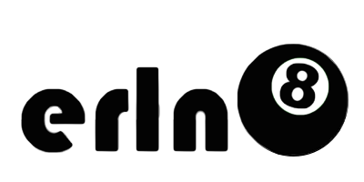

## What is erln8?

ernl8 v2 contains several tools that let a developer set custom versions of Erlang, Rebar, and Rebar3 per directory. This allows you to "set and forget" versions of your tools for a project once.

erln8 v2 ships with 3 binaries:

- `erln8` - Erlang version manager, completely rewritten from the ground up.
- `reo` - Rebar version manager, uses the same core code that erln8 uses.
- `reo3` - Same as reo, but for Rebar3.

## Getting started

See the [installation](installation.md) and [quickstart](quickstart.md) guide.

## Getting help

You can ask questions on the Freenode #erln8 IRC channel.

You can also ask questions on the [erln8](https://groups.google.com/forum/?hl=en#!forum/erln8) mailing list.

## FAQ

- What language is it written in?
	- D, it's super fast, easy, and it's not C++ or C.

- Why isn't it written in Erlang?	
	- chicken and egg, I never assumed you'd have Erlang built to be used by a tool that builds Erlang.

- No really, why not \<language X\>?
	- Erlang is slow for command line tools, I wanted a tool that could be used in a command line prompt.
	- I played around with implementing erln8 in the following, all of which weren't a great fit:
		- C++
		- Racket
		- Haskell
		- OCaml
		- Rust
		- Go

- But D is weird!
	- so are kitten elbows
	
- What does reo mean?
	- Australian slang for "rebar"

- Does erln8 support MS Windows?
	- I don't own Windows, but if you want to submit PR's to support it and build precompiled binaries, I'll all for it.

- Do you sing at parties?
	-  No, not really.

## Getting help

You can ask questions on the Freenode #erln8 IRC channel.

You can also ask questions on the [erln8](https://groups.google.com/forum/?hl=en#!forum/erln8) mailing list.

---

© 2015 Dave Parfitt

